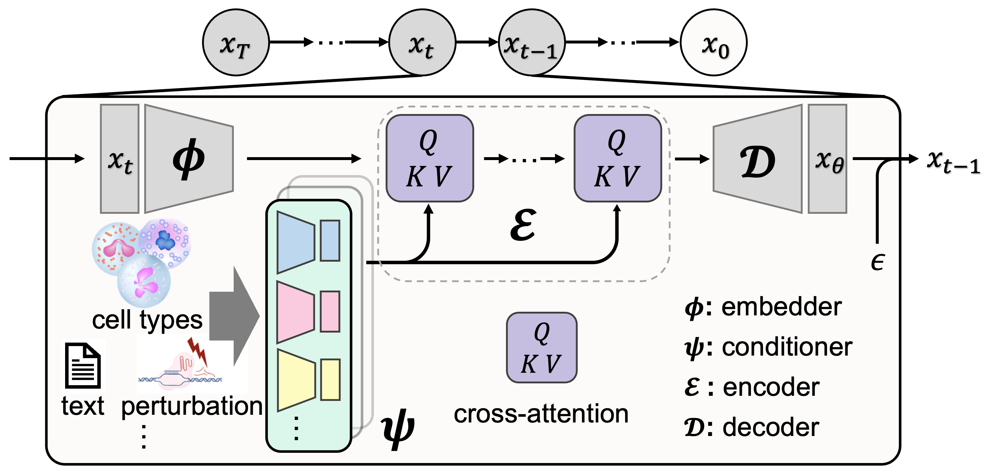

# scDiff


This is the official codebase for [A General Single-Cell Analysis Framework via Conditional Diffusion Generative Models](https://www.biorxiv.org/content/10.1101/2023.10.13.562243v1).

[](https://www.biorxiv.org/content/10.1101/2023.10.13.562243v1)

*scDiff* achieves competitive performance with state-of-the-art models in various benchmarking tasks. By incorporating prior knowledge with large language models and graph neural networks, *scDiff* shows outstanding few-shot and zero-shot results.

## Installation

```bash
conda create -n scdiff python=3.9 -y && conda activate scdiff

# PyTorch
conda install pytorch==2.0.1 torchvision torchaudio pytorch-cuda=11.8 -c pytorch -c nvidia -y

# PyG
conda install pyg==2.3.1 -c pyg

# Other dependencies
pip install -r requirements.txt

# scDiff
pip install -e .

conda clean --all -y
```

## Set up data

```bash
# Install gdown for downloading data and pre-trained models
pip install gdown

gdown https://drive.google.com/file/d/1Dbf1aX-OZ8FOGVEi4PhKiDRcvBOrnyAI/view?usp=sharing --fuzzy
tar -xzvf reproducibility.tar.gz && mv reproduce/ data/
```

## Run main evaluations

```bash
### Annotation experiments
SEED=10 bash run/run.sh annotation

### Imputation experiments
SEED=10 bash run/run.sh denoising

### Perturbation experiments
SEED=10 bash run/run.sh perturbation

### Gene perturbation experiments
SEED=10 bash run/run.sh genepert

### One-shot annotation experiments
SEED=10 TOPK=3 bash run/oneshot.sh
```

<!-- ## TODOs

- [ ] Refactor
    - [x] ~Remove unused GEARS components~ (moved to `ext` instead).
    - [ ] Refactor scdiff model (registry style to allow user extention).
        - [ ] Modules
            - [x] Embedder
            - [x] Encoder
            - [x] Decoder
        - [ ] Conditioners (class, context, llm, gears)
            - [ ] Processor (parallel or sequential MLP)
    - [x] Rename celldiff to scdiff.
    - [ ] Make sure we can reproduce previous results.
- [ ] Others
    - [ ] Tutorial / short note on README with an user extention example.
    - [ ] Remove tests if no other test will be added besides the current one.
    - [x] Remove baseline run script? (move to reproduce repo if needed)
- [ ] Finalize
    - [x] Clean up results: only preserve the final results.
    - [x] Update notebooks and remove unused ones.
    - [ ] Update License info.
    - [ ] Full run down test (installation -> run -> plot) -->